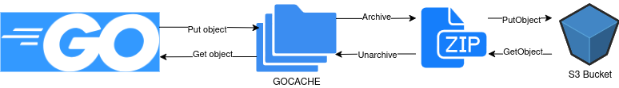
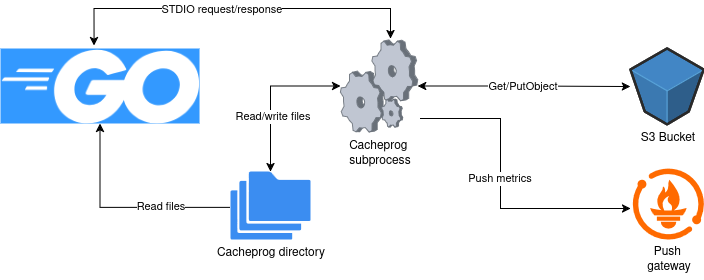

Cacheprog
=========
[](https://github.com/platacard/cacheprog/actions/workflows/pull_request.yml)

[](https://opensource.org/licenses/Apache-2.0)

This tool is a [GOCACHEPROG](https://go.dev/doc/go1.24#gocacheprog) implementation that uses S3/Minio-compatible storages as a remote storage backend.
It helps to maintain a stable and fast CI job run times by hooking up Go compiler cache directly to external storage.

- [Rationale](#rationale)
- [Installation](#installation)
- [Configuration](#configuration)
  - [S3-compatible storage configuration](#s3-compatible-storage-configuration)
  - [HTTP storage configuration](#http-storage-configuration)
  - [Metrics pushing configuration](#metrics-pushing-configuration)
  - [Disk storage configuration](#disk-storage-configuration)
- [Usage](#usage)
  - [Running Go compiler directly in a CI job](#running-go-compiler-directly-in-a-ci-job)
  - [Running Go compiler during Docker image building (Dockerfile `RUN` instruction)](#running-go-compiler-during-docker-image-building-dockerfile-run-instruction)
  - [Golangci-lint](#golangci-lint)
  - [Transition from earlier Go versions](#transition-from-earlier-go-versions)
- [Troubleshooting](#troubleshooting)
  - [Debugging, profiling and tracing](#debugging-profiling-and-tracing)
  - [Resetting cache](#resetting-cache)
- [Development](#development)
  - [Tests](#tests)
  - [Local environment](#local-environment)

## Rationale

If your CI pipeline configured to preserve Go compiler cache it, most likely, works in the following way:
* Initial run:
    1. Run go compiler
    2. Archive `GOCACHE` directory
    3. Upload archive to external storage
* Following runs:
    1. Download archive from external storage
    2. Unpack archive into `GOCACHE` directory
    3. Run go compiler
    4. Archive `GOCACHE` directory
    5. Upload archive to external storage
This is how [GitLab CI caching](https://docs.gitlab.com/ci/caching/), [Github Actions Cache](https://github.com/marketplace/actions/cache) and probably other ones work. [Docker distributed caching](https://docs.docker.com/build/cache/backends/) (`--cache` args in `RUN`) also work in a similar way.



This technique does work without extra tools but has a major downside: pushing and pulling _orphan objects_ from/to remote storage.
Such objects are result of changes in source code, compiler version, etc. They are still present in cache but probably never will be used in a future.
It also prevents possible deduplication on external storage side.
Go standard library is included in every project so compiling may it will generate a lot of objects that are identical between all projects.

To be fair Go compiler performs periodical cache trimming to avoid bloating but this problem hit us hard when we tried to preserve cache for [golangci-lint](https://golangci-lint.run/). We experienced a severe delays during uploading/downloading and (un)packing golangci-lint cache. That delays suddenly became so big that **clean runs (without cache) became faster than runs with cache.**

However, in Go 1.24 we got `GOCACHEPROG`-plugin support. It's became possible for Go compiler to directly interact with external storage and query individual objects in it.
So we decided to develop such plugin to interact with S3 in our CI environment. Integration of this plugin gave us improved and stable job run times.



We are aware about already existing implementation from [Tailscale](https://github.com/tailscale/go-cache-plugin/) but it has features that we don't need (http and module/sumdb proxy) and doesn't have features we need: object compression, Minio compatibility for testing purposes, metrics pushing, pluggable external storages like it's done in [Athens](https://gomods.io/configuration/storage/#external-storage).

Also we tried to maintain a balance between resulting binary size and verstility by choosing dependencies wisely i.e. https://github.com/VictoriaMetrics/metrics/ instead of standard prometheus metrics library and keeping track of [dead-code-elimination usage](https://appliedgo.net/spotlight/reflection-binary-size/).

To reduce storage cost and upload/download times objects are transparently being compressed/decompressed using `zstd` algorithm with default settings.
To improve run times this tool asynchronously uploads objects to remote storage and storing object metadata in S3 metadata instead of additional metadata file.

## Installation

This tool is intended to use in CI enviroments and distributed as a Docker image with single binary because it's a most versatile way to distribute tools for CI.

We **do not recommend** to install from source code using `go get`/`go install` inside CI job because it will compile in every single job run and basically ruin the whole idea of caching in external storage to reduce job run time.

To see all possible settings and their descriptions run `cacheprog direct --help` or `cacheprog proxy --help`.

## Configuration

You will need an S3 bucket with read-write access from CI jobs and optionally metrics collector like [Prometheus Pushgateway](https://github.com/prometheus/pushgateway) or [VictoriaMetrics](https://docs.victoriametrics.com/victoriametrics/keyconcepts/#push-model) configured to accept metric pushes.

**Note**. S3 bucket should be as close as possible to CI job runners because Go compiler cache is latency-sensitive. Self-compilation with prefilled cache on a local machine showed that extra 50ms latency with 10ms jitter to each request increases compile time from 1s to 8s.

To use custom external storage incompatible with AWS S3 you can run HTTP server using [./pkg/httpstorage/server.go](./pkg/httpstorage/server.go).

Switching between different storages is done via `CACHEPROG_REMOTE_STORAGE_TYPE` environment variable. Available values: `s3`, `http`, `disabled`. Default: `disabled`.

### S3-compatible storage configuration

Environment variables for S3-compatible storage are:
* `CACHEPROG_S3_ENDPOINT` - Storage endpoint, not needed for AWS S3.
* `CACHEPROG_S3_BUCKET` - S3 bucket name, required.
* `CACHEPROG_S3_REGION` - S3 region name. If not provided will be detected automatically via [GetBucketLocation API](https://docs.aws.amazon.com/AmazonS3/latest/API/API_GetBucketLocation.html).
* `CACHEPROG_S3_FORCE_PATH_STYLE` - Enable path-style routing instead of virtual-hosted-style routing. [Detailed description](https://docs.aws.amazon.com/AmazonS3/latest/userguide/VirtualHosting.html). Default: `false`.
* `CACHEPROG_S3_ACCESS_KEY_ID` - S3 access key id, not needed for AWS S3.
* `CACHEPROG_S3_ACCESS_KEY_SECRET` - S3 access key secret, not needed for AWS S3.
* `CACHEPROG_S3_SESSION_TOKEN` - S3 session token, not needed for AWS S3.
* `CACHEPROG_S3_CREDENTIALS_ENDPOINT` - Credentials endpoint for S3-compatible storages, not needed for AWS S3.
* `CACHEPROG_S3_PREFIX` - Prefix for S3 keys, useful to run multiple apps on same bucket i.e. for separation between multiple projects in one bucket or coexistance with [sccache](https://github.com/mozilla/sccache). Templated, `GOOS`, `GOARCH` and `env.<env var>` are available. Template format: ``.
* `CACHEPROG_S3_EXPIRATION` - Sets expiration for each S3 object during Put, 0 - no expiration. Accepts duration string, e.g. `1h`, `10m`, `10s`, etc.
* `CACHEPROG_S3_EXCLUDE_HEADERS_FROM_SIGNING` - Exclude specific headers from request signature. Comma-separated list, e.g. `Accept-Encoding,...`. Some S3-compatible storage providers are altering headers internally and this breaks request signature verification.

Coniguration notes for some S3-compatible storages:
* **AWS S3**: nothing special needed.
* **Minio**: use schemes `minio+http://`, `minio+https://` for endpoint because Minio uses a little bit different path resolution logic for buckets. Login and password are provided via `CACHEPROG_S3_ACCESS_KEY_ID` and `CACHEPROG_S3_ACCESS_KEY_SECRET`.
* **Google Cloud Storage**: https://cloud.google.com/storage/docs/aws-simple-migration, extra variables needed: `CACHEPROG_S3_ENDPOINT` set to `https://storage.googleapis.com`, `CACHEPROG_S3_ACCESS_KEY_ID`, `CACHEPROG_S3_ACCESS_KEY_SECRET`. `CACHEPROG_S3_REGION` may be set to `auto`.
Also you can set `CACHEPROG_S3_EXCLUDE_HEADERS_FROM_SIGNING` to `Accept-Encoding` if you're getting errors like `SignatureDoesNotMatch` or just observe zero hits every time.
See https://github.com/aws/aws-sdk-go-v2/issues/1816 and https://discuss.google.dev/t/server-side-modification-of-header-seems-to-cause-signaturedoesnotmatch-error/141788/3 for more details.
* **DigitalOcean Spaces**: https://docs.digitalocean.com/products/spaces/how-to/use-aws-sdks/, extra variables needed: `CACHEPROG_S3_ENDPOINT` set to `https://<region>.digitaloceanspaces.com`, `CACHEPROG_S3_ACCESS_KEY_ID` is `SPACES_KEY`, `CACHEPROG_S3_ACCESS_KEY_SECRET` is `SPACES_SECRET`. `CACHEPROG_S3_REGION` may be set to `us-east-1`.
* **Alibaba OSS**: https://www.alibabacloud.com/help/en/oss/developer-reference/use-amazon-s3-sdks-to-access-oss, extra variables needed: `CACHEPROG_S3_ENDPOINT` set to `https://oss-<region>.aliyuncs.com`, `CACHEPROG_S3_ACCESS_KEY_ID` is `OSS_ACCESS_KEY_ID`, `CACHEPROG_S3_ACCESS_KEY_SECRET` is `OSS_ACCESS_KEY_SECRET`. `CACHEPROG_S3_REGION` may be set to `oss-<region>`.
* **Ceph via Rados Gateway**: https://docs.ceph.com/en/latest/radosgw/s3/, extra variables needed: `CACHEPROG_S3_ENDPOINT` set to Rados Gateway URL, `CACHEPROG_S3_ACCESS_KEY_ID`, `CACHEPROG_S3_ACCESS_KEY_SECRET`, `CACHEPROG_S3_FORCE_PATH_STYLE` set to `true`.

### HTTP storage configuration

To simplify setup we provide an adapter that wraps Go interface implementation into HTTP server. See [./pkg/httpstorage/server.go](./pkg/httpstorage/server.go) for details.

Environment variables for HTTP storage are:
* `CACHEPROG_HTTP_STORAGE_BASE_URL` - Base URL, required.
* `CACHEPROG_HTTP_STORAGE_EXTRA_HEADERS` - Extra headers to be added to each request. Comma-separated list of `key:value` pairs.

### Metrics pushing configuration

Prometheus Pushgateway or VictoriaMetrics configured to accept metric pushes are required in this case.

Environment variables for Metrics pushing are:
* `CACHEPROG_USE_VM_HISTOGRAMS` - Use [VictoriaMetrics-style histograms](https://docs.victoriametrics.com/victoriametrics/keyconcepts/#histogram) with dynamic buckets instead of Prometheus-style if `1`. Default: `0`. If you use VictoriaMetrics as a metrics storage you should set this to `1`.
* `CACHEPROG_METRICS_PUSH_ENDPOINT` - Metrics endpoint, metrics will be pushed if provided.
* `CACHEPROG_METRICS_PUSH_METHOD` - HTTP method to use for sending metrics. Default: `GET`.
* `CACHEPROG_METRICS_PUSH_EXTRA_LABELS` - Extra labels to be added to each metric, format: `key=value`.
* `CACHEPROG_METRICS_PUSH_EXTRA_HEADERS` - Extra headers to be added to each request. Comma-separated list of `key:value` pairs.

All application-specific metrics are prefixed with `cacheprog_` prefix.

### Disk storage configuration

`GOCACHEPROG` protocol requires to store files on disk and these files must be accessible by Go compiler. You can specify root directory for disk storage via `CACHEPROG_DISK_STORAGE_ROOT` environment variable. If not provided, temporary directory will be used.

**NOTE**. Cacheprog does not perform any kind of garbage collection on disk storage so this directory should not be preserved between CI job runs.

More detailed installation and usage process will be described in usecases.

## Usage
### Running Go compiler directly in a CI job

To deliver a `cacheprog` binary to CI job we recommend to create a custom base image with Go compiler, cacheprog binary and other dependencies.
Cacheprog binary may be added via
```dockerfile
COPY --from=<cacheprog-image> /cacheprog /bin/cacheprog
```
instruction.

This is a recommended approach because such base images may be cached on runner nodes (in case of appropriate runner configuration, of course) so job may start much faster.

CI job must have following environment variables set:
* `GOCACHEPROG` - path to `cacheprog` binary.
* storage configuration variables.

Other flags or environment variables may be set depending on the needs. To see them run `cacheprog direct --help`.

### Running Go compiler during Docker image building (Dockerfile `RUN` instruction)

This is a case when your project is being build by running `docker build` command in CI. So you have something like this in your Dockerfile:
```dockerfile
ARG GO_VERSION=1.25
FROM golang:{GO_VERSION}-alpine AS builder
RUN go build -o /bin/project ./cmd/project
```

To make things possible here we provide a `cacheprog proxy` mode.
In this mode cachprog runs as a sidecar for translating requests from `http` storage type into any storage type.
It allows us to not deal with authentication inside docker build context.

**NOTE**. This mode is not intended to be used as dedicated service because it does not contain any authentication mechanism for incoming requests. 

Setup is a bit more complex in this case. Following things are required:
* custom base image with Go compiler, cacheprog binary and other dependencies
* all project dockerfiles should inherit this base image
* started cachprog in a proxy mode before running `docker build` command, cacheprog proxy must be network-accessible from `docker build` command

Base image also must have following settings in `ONBUILD` instructions:
```dockerfile
ONBUILD ARG CACHEPROG_SERVER=cacheprog:8080
ONBUILD ENV \
    CACHEPROG_REMOTE_STORAGE_TYPE=http \
    CACHEPROG_HTTP_STORAGE_BASE_URL=http://${CACHEPROG_SERVER}/ \
    CACHEPROG_METRICS_PUSH_ENDPOINT=http://${CACHEPROG_SERVER}/metricsproxy \ # if you want to push metrics
    GOCACHEPROG="/bin/cacheprog"
```

And then all dockerfiles in project should inherit from this base image.
```dockerfile
ARG GO_IMAGE
FROM ${GO_IMAGE} AS builder
RUN go build -o /bin/project ./cmd/project
```

CI job must be configured in a following way (assuming all necessary preparations are done before):
1. set basic environment variables:
   * `CACHEPROG_PROXY_PORT` - port to listen on for cacheprog proxy.
   * `CACHEPROG_SERVER` - address to connect to cacheprog proxy, i.e. `"127.0.0.1:${CACHEPROG_PROXY_PORT}"`.
   * remote storage configuration variables
2. run a cacheprog proxy with credentials necessary to access remote storage. I.e. for AWS S3:
    ```bash
    if [[ -f "$AWS_WEB_IDENTITY_TOKEN_FILE" ]]; then
        export DOCKER_VOLUME_BINDINGS="$DOCKER_VOLUME_BINDINGS --volume ${AWS_WEB_IDENTITY_TOKEN_FILE}:${AWS_WEB_IDENTITY_TOKEN_FILE}:ro"
    fi
    docker run \
        --network host \ # may be custom network but we found that its the most convenient way
        --detach \
        --name cacheprog \
        --entrypoint /bin/cacheprog \
        --env CACHEPROG_PROXY_LISTEN_ADDRESS=0.0.0.0:${CACHEPROG_PROXY_PORT} \
        --env CACHEPROG_METRICS_PROXY_ENDPOINT=${CACHEPROG_METRICS_PUSH_ENDPOINT} \ # METRICS_PROXY variables needs to be set if you want to push metrics
        --env CACHEPROG_METRICS_PROXY_EXTRA_LABELS=${CACHEPROG_METRICS_PUSH_EXTRA_LABELS} \
        --env CACHEPROG_METRICS_PROXY_EXTRA_HEADERS=${CACHEPROG_METRICS_PUSH_EXTRA_HEADERS} \
        --env-file <(env | grep -E '^AWS_|^CACHEPROG_') \
        ${DOCKER_VOLUME_BINDINGS} \
        ${GO_IMAGE} proxy || true
    ```
    `GO_IMAGE` is a base image mentioned before.
2. provide extra build arguments to docker build command:
    ```bash
    export BUILDER_BUILD_ARGS="$BUILDER_BUILD_ARGS \
        --build-arg GO_IMAGE=${GO_IMAGE} \
        --build-arg CACHEPROG_SERVER=${CACHEPROG_SERVER}"
    docker build --network host ${BUILDER_BUILD_ARGS} -f ${BUILDER_DOCKERFILE_LOCATION}/Dockerfile -t ${BUILDER_REGISTRY_IMAGE} ${BUILDER_BUILD_CONTEXT}
    ```
3. collect logs from cacheprog proxy:
    ```bash
    docker logs cacheprog || true
    ```

Note that we used `|| true` to avoid job failure if cacheprog proxy fails to start. Cacheprog running inside docker build context can tolerate unavailable external storage. Also note that we're not using things like [GitLab services](https://docs.gitlab.com/ci/service) to run a cacheprog proxy because in this case it's hard to make it accessible from docker build context.


### Golangci-lint

This case is almost similar to direct running Go compiler in a CI job. Here we also recommend to create a custom base image from [golangci/golangci-lint](https://hub.docker.com/r/golangci/golangci-lint/) image.

Settings are almost the same as for Go compiler with small differences:
* `GOLANGCI_LINT_CACHEPROG` must be set. We recommend to set it to something like `<cacheprog-path> --s3-prefix="/golangci-lint-cache"`. This needed because golangci-lint has own caching mechanism and separating it from Go compiler cache should prevent possible conflicts.
* `GOCACHEPROG` recommended to be set to `<cacheprog-path> --log-output=gocacheprog.log` to collect logs because golangci-lint runs Go compiler in a subprocess under the hood and logs from it are not visible in the main process.

### Transition from earlier Go versions

If you are planning to support Go versions older than 1.24 on your CI environment, you can simply combine old-style caching via `GOCACHE` and caching via `GOCACHEPROG`.
`GOCACHEPROG` takes priority if specified so after updating Go to 1.24 it will be used automatically. Just make sure that `GOCACHE` and `CACHEPROG_ROOT_DIRECTORY` are not the same.

However, we recommend to add a script to automatically cleanup `GOCACHE` in case of `GOCACHEPROG` being used to clear CI-managed cache. Something like this:
```bash
if [[ -d "$CACHEPROG_ROOT_DIRECTORY" ]]; then
    # GOCACHEPROG was used, cleanup CI cache directory to prevent further pulling
    rm -rf "$GOCACHE"
    rm -rf "$GOLANGCI_LINT_CACHE"
    # Force CI cache cleanup
    mkdir -p "$GOCACHE"
    touch "$GOCACHE/.empty"
fi
```
In this case `CACHEPROG_ROOT_DIRECTORY` must be explicitly provided in job environment variables.

## Troubleshooting

### Debugging, profiling and tracing

To enable debugging, profiling and tracing you can use following environment variables:
* `CACHEPROG_LOG_LEVEL` - logging level. Available: `DEBUG`, `INFO`, `WARN`, `ERROR`. Default: `INFO`.
* `CACHEPROG_CPU_PROFILE_PATH` - path to write CPU profile.
* `CACHEPROG_MEM_PROFILE_PATH` - path to write memory profile.
* `CACHEPROG_TRACE_PROFILE_PATH` - path to write trace profile.
* `CACHEPROG_FGPROF_PATH` - path to write [fgprof](https://github.com/felixge/fgprof) (wall-clock profiling) profile.

All these variables are optional and if not provided nothing will be written. Artifacts produced by cachprog may be collected using your CI artifact collection mechanism.

**NOTE**. `DEBUG` logging level generates **a lot** of logs so it's not recommended to use it in production.

### Resetting cache

If you encounter a weird compiler errors after i.e. upgrading Go compiler version it's most likely because Go compiler picked up wrong cache object due to changed object key computation logic.

To deal with it you may set `CACHEPROG_DISABLE_GET=true` environment variable to disable getting objects from any storage. This will force Go compiler to recompile the project and populate cache again. This variable may be wired to CI labels to make this process a bit more convenient. 

## Development

### Tests

To run e2e tests see [functests](./functests/README.md).

### Local environment

This project includes a [docker-compose.yml](./deployments/compose/docker-compose.yml) file to run local environment for testing. It has 
* Minio server to simulate external storage.
* Toxiproxy to simulate network latency and failures.

To run it use:
```bash
docker compose -f deployments/compose/docker-compose.yml up
```
By default minio web interface is available at `http://localhost:9001`, s3 interface is available at `http://localhost:9000`. Default credentials are `minioadmin` for both login and password.

Toxiproxy may be used to simulate network latency and failures. It's configured in `deployments/compose/toxiproxy.json` file. I.e. to simulate 50ms latency and 10ms jitter run:
```bash
docker-compose -f deployments/compose/docker-compose.yml exec toxiproxy /toxiproxy-cli toxic add -t latency -a latency=50 -a jitter=10 minio_master
```
And this is the way it was used to measure impact of network latency on compile time.
